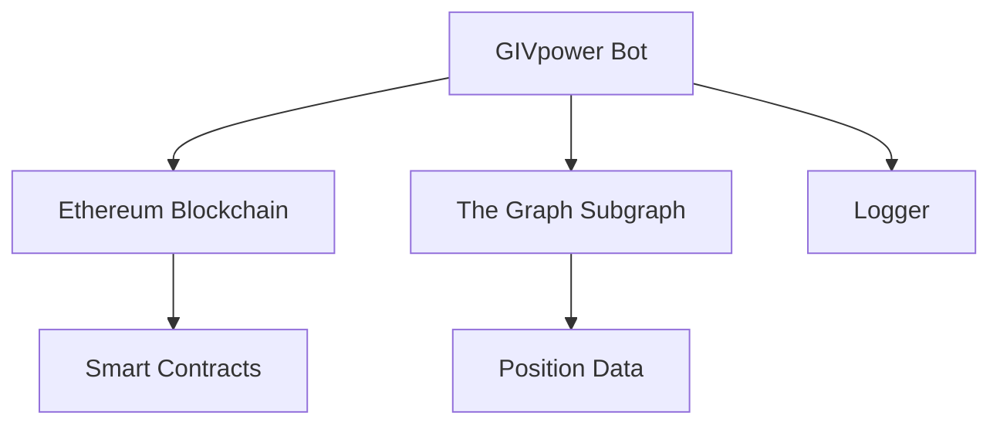

# GIVpower Bot

## 1. Project Overview

### Purpose
The GIVpower Bot is a service that automates the unlocking of GIVpower positions in the Giveth ecosystem. It monitors and manages the unlocking process of staked GIV tokens, ensuring smooth operation of the GIVpower system.

### Key Features
- Automated unlocking of GIVpower positions
- Integration with Ethereum blockchain
- Subgraph querying for position data
- Configurable service intervals
- Comprehensive logging system

### Live Links
- Mainnet: [Giveth Platform](https://giveth.io)
- Documentation: [Giveth Docs](https://docs.giveth.io)

## 2. Architecture Overview

### System Diagram


### Tech Stack
- TypeScript
- Ethers.js for blockchain interaction
- GraphQL for subgraph queries
- Winston for logging
- PM2 for process management

### Data Flow
1. Bot queries subgraph for unlockable positions
2. Validates positions against blockchain state
3. Executes unlock transactions when conditions are met
4. Logs all actions and results

## 3. Getting Started

### Prerequisites
- Node.js (v18 or higher)
- Yarn package manager
- TypeScript (v4.7.4 or higher)
- Access to Ethereum node (Infura/Alchemy)
- PM2 (for production deployment)

### Installation Steps
1. Clone the repository:
   ```bash
   git clone https://github.com/Giveth/givpower-bot.git
   cd givpower-bot
   ```

2. Install dependencies:
   ```bash
   yarn install
   ```

3. Build the project:
   ```bash
   yarn build
   ```

### Configuration
Create a `.env` file in the root directory with the following variables:
```
NODE_ENV=develop
INFURA_PROJECT_ID=your_infura_id
PRIVATE_KEY=your_wallet_private_key
```

## 4. Usage Instructions

### Running the Application
- Development mode:
  ```bash
  yarn start-dev
  ```

- Production mode:
  ```bash
  yarn serve
  ```

### Testing
Run the linter:
```bash
yarn tslint
```

Fix linting issues:
```bash
yarn tslint:fix
```

### Common Tasks
- Clean build directory:
  ```bash
  yarn clean
  ```

- Rebuild project:
  ```bash
  yarn build
  ```

## 5. Deployment Process

### Environments
- Development: Local development and testing
- Production: Mainnet deployment

### Deployment Steps
1. Ensure all environment variables are set
2. Build the project: `yarn build`
3. Start the service: `yarn serve`

### CI/CD Integration
The project uses GitHub Actions for CI/CD. Workflows are defined in the `.github/workflows` directory.

## 6. Troubleshooting

### Common Issues
1. **Connection Issues**: Ensure your Infura/Alchemy endpoint is working
2. **Transaction Failures**: Check gas prices and network congestion
3. **Subgraph Errors**: Verify subgraph health and synchronization

### Logs and Debugging
- Logs are stored in the `logs` directory
- Use Winston logger for detailed debugging
- Check PM2 logs for production issues:
  ```bash
  pm2 logs givpower-bot
  ```

## License
ISC License - See [LICENSE](LICENSE) file for details
Deployed to `service.giveth.io`

