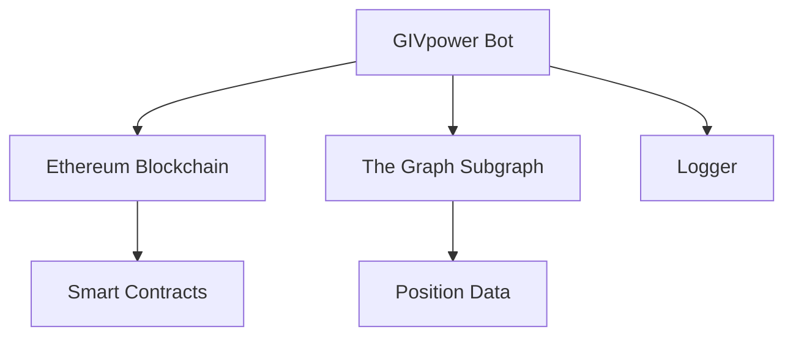

# GIVpower Bot

## 1. Project Overview

### Purpose
The GIVpower Bot is a service that automates the unlocking of GIVpower positions in the Giveth ecosystem. It monitors and manages the unlocking process of staked GIV tokens, ensuring smooth operation of the GIVpower system.

### Key Features
- Automated unlocking of GIVpower positions
- Integration with EVM blockchains
- Subgraph querying for position data
- Configurable service intervals
- Configurable unlock batch size

### Live Links
- Mainnet: [Giveth Platform](https://giveth.io)
- Documentation: [Giveth Docs](https://docs.giveth.io)

## 2. Architecture Overview

### System Diagram


### Tech Stack
- TypeScript
- Ethers.js for blockchain interaction
- GraphQL for subgraph queries
- Winston for logging
- PM2 for process management

### Data Flow
1. Bot queries subgraph for unlockable positions
2. Executes unlock transactions when conditions are met
3. Logs all actions and results

## 3. Getting Started

### Prerequisites
- Node.js (v18 or higher)
- Yarn package manager
- TypeScript (v4.7.4 or higher)
- Access to Ethereum node (Infura/Alchemy)
- PM2 (for production deployment)

### Installation Steps
1. Clone the repository:
   ```bash
   git clone https://github.com/Giveth/givpower-bot.git
   cd givpower-bot
   ```

2. Install dependencies:
   ```bash
   yarn install
   ```

3. Build the project:
   ```bash
   yarn build
   ```

### Configuration
Create a `.env` file in the config directory by copying the `.env.example` file.

**NOTE:** You can create `<NODE_ENV>.env` file and set `NODE_ENV` in command line to read the correct environment variables.

## 4. Usage Instructions

### Running the Application
- Development mode:

  Create a `develop.env` file in the config directory by copying the `.env.example` file. Fill in the correct values for the environment variables.
  ```bash
  yarn start-dev
  ```

- Production mode:

  Create `.env` file in the config directory by copying the `.env.example` file. Fill in the correct values for the environment variables.
  ```bash
  yarn serve
  ```

### Common Tasks
- Clean build directory:
  ```bash
  yarn clean
  ```

- Rebuild project:
  ```bash
  yarn build
  ```

## 5. Deployment Process

### Environments
- Copy `.env.example` file to `.env` in the config directory.
### Deployment Steps
- Run `docker compose up -d` to start the service.

### CI/CD Integration
The project uses GitHub Actions for CI/CD. Workflows are defined in the `.github/workflows` directory.

## 6. Troubleshooting

### Common Issues
1. **Connection Issues**: Ensure your NODE_URL is working
2. **Transaction Failures**: Check gas prices, account corresponding to `PRIVATE_KEY` has enough balance, GIVPOWER_CONTRACT_ADDRESS, and network congestion
3. **Subgraph Errors**: Verify subgraph health and synchronization

### Logs and Debugging
- Logs are stored in the `logs` directory
- Use Winston logger for detailed debugging
